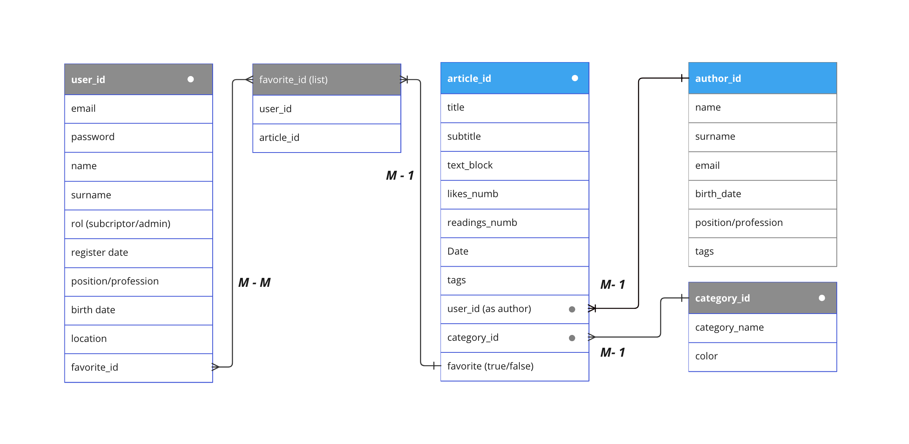

# Blog-FullStack-project - ARTICLES - Back-End
## Node - Express - SQL - React - Vite 

### Introducción

ENTRIES es una aplicación de registro de artículos de contenido académico creados por profesores con el fin de compartir contenidos que se ven en el aula. 

#### Las funcionalidades previstas son: 

+ Registro  de usuarios con  dos tipos de rol, estudiante  y alumno. 

#### Los profesores pueden: 
    ++ Registrarse.
    ++ Darse de baja.
    ++ Crear, editar, actualizar y eliminar artículos (CRUD).
    ++ Crear, editar, actualizar y eliminar  categorías (CRUD). 
    ++ Copiar mediante un botón de copia rápida el enlace a cada artículo para poder compartirlo. 
    ++ Gestionar autorizaciones de lectura a usuarios identificados por e-mail (se puede autorizar a otros profesores o a estudiantes).
    ++ Activar/desactivar la opción de acceso público a los artículos.
     ++ Las listas de favoritos tendrán nombre (análogo a la utiidad de categoría del profesor).
    ++ Habrá una lista de favoritos por defecto para usuarios que no deseen crear listas con nombre.
    ++ Filtrar/buscar artículos por categoría y por título.
    ++ Ordenar los artícullos de forma ascendente y descendiente por título cuando están listados.

#### Los estudiantes pueden: 

    ++ Registrarse.
    ++ Darse de baja.
    ++ Leer artículos compartidos  por el profesor/a cuando están autorizados o cuando el artículo es de acceso públlco.
    ++ Marcar/desmarcar artículos como favoritos.
    ++ Crear, editar y eliminar listas de favoritos. 
    ++ Las listas de favoritos tendrán nombre (análogo a la utiidad de categoría del profesor) y se crearán como tags.
    ++ Habrá una lista de favoritos por defecto para usuarios que no deseen crear listas con nombre.
    ++ Filtrar/buscar artículos por categoría y por título.
    ++ Ordenar los artícullos de forma ascendente y descendiente por título cuando están listados.

#### Los campos requeridos para todos los usuarios son: 

    ++ Nombre
    ++ Apellidos
    ++ Email
    ++ Password
    ++ Rol
    ++ Fecha de nacimiento

#### Los datos no requeridos a completar en el perfil son:
    ++ Adscripción institucional
    ++ Ubicación habitual
    ++ Idioma nativo
    ++ Profesión
    ++ Fecha de nacimiento
     
#### Los campos requeridos para crear un artículo son: 

    ++ Id de artículo.
    ++ Título.
    ++ Abstract de no más de 40 palabras.
    ++ Texto del contenido.
    ++ Imágenes.
    ++ Estará relacionado con los datos del autor mediante el Id del autor.

#### Los campos requeridos para una categoría son: 

    ++ Nombre
    ++ Color
    *Un artículo sólo puede pertenecer a una categoría. En caso de dudas, se puede utilizar las tag/nombres de lista de favoritos.

## Modelo de datos

    * Las tablas en color gris no se consideran. Forman parte de una previsión a futuro.*  




## Pasos para ejecutar el proyecto

1. Clona el repositorio:  


2. Ejecuta el siguiente comando para que se instalen totdas las dependencias necesarias: 

`npm i ci`

3. Crea una réplica de las bases de datos en tu servidor locall. Encontrarás las queries SQL necesarias en server/uils/queries.js desde la carpeta raíz.

## Ejemplo de uso: 

### Desde el sitio web: 
Accede al menú "Nuevo artículo" e inttroduce los datos. Después podrás comprobar en tu base de datos que el artículo ha sido creado.

### Desde Postman: 
Puedes utilizar los siguientes datos para probar cualquiera de las peticiones que aparecen en el archivo server/utils/posttman_collection.json. A continuación se explican los pasos a seguir para hacer la prueba creando un nuevo artículo:

#### Ejemplo probando la creación de un nuevo artículo desde Postman: 

+ Accede a Postman
+ Importa el archivo mencionado
+ Introduce uno de los dos objetos de abajo en la pestaña "Body". 
+ Selecciona el método POST. 
+ Pulsa enviar. 
+ Comprueba en tu base de datos que el artículo se ha creado. 

```
{
    "title": "Descubren la vacuna contra la gripe A",
    content: "Si vas a utilizar un pasaje de Lorem Ipsum, necesitás estar seguro de que no hay nada avergonzante escondido en el medio del texto. Todos los generadores de Lorem Ipsum que se encuentran en Internet tienden a repetir trozos predefinidos cuando sea necesario, haciendo a este el único generador verdadero (válido) en la Internet. Usa un diccionario de mas de 200 palabras provenientes del latín, combinadas con estructuras muy útiles de sentencias, para generar texto de Lorem Ipsum que parezca razonable. Este Lorem Ipsum generado siempre estará libre de repeticiones, humor agregado o palabras no características del lenguaje, etc.",
    "id_author":1,
    "date": "2024-04-30",
    "category": "Medicina",
    "entry_image": "https://www.consalud.es/uploads/s1/30/13/94/2/sanitario-preparando-una-vacuna-fuente-canva_34_1200x510.jpeg" 
}
```

```
{
    "title":"Nuevas formas de pensar la experiencia",  
    "content": "El usuario de un sitio web es inigualable en el planeta. La biodiversidad de relleno de las imprentas y archivos de texto. Lorem Ipsum ha sido el texto de relleno estándar de las industrias desde el año 1500, cuando un impresor (N. del T. persona que se dedica a la imprenta) desconocido usó una galería de textos y los mezcló de tal manera que logró hacer un libro de textos especimen. No sólo sobrevivió 500 años, sino que tambien ingresó como texto de relleno en documentos electrónicos, quedando esencialmente igual al original. Fue popularizado en los 60s con la creación de las hojas.", 
    "date": "2024-04-30",
    "id_author": 3,
    "category": "Diseño",
    "enry_image": "https://www.lavanguardia.com/files/image_948_465/uploads/2022/04/13/625713f6667a3.jpeg"
}
```

## Tecnologías empleadas

Tecnologías Back-end: Node.js + Express + PostgreSQL 

Tecnologías Front-end: React + Vite

Bases de datos relacionales (SQL) - PgAdmin

Docker

Librerías: 

npm
nodemon
Create React Component Folder
Axios
CORS
dotenv


### Node.js Application shema


## Tareas conseguidas

### Front-end

[X] Externalización de las
[X] Creación de una aplicación front con React + Vite
[X] CSS plano.
[X] Responsividad con media queries
[X] Diseño responsivo de: 
    [X] Home con listado de Cards de artículos.(GET)
    [X] Filtro por Título
    [X] Filtro por Categoría
    [X] Ordenación A-Z/Z-A
    [X] Formulario de creación de nuevo artículo (POST)
    [X] Lisado de Cards de autores (GET)
    [X] Barra de navegación con marcadores de estado

### Back-end

    [X] Sistema modelo-conrolador implementado y funcionando
    [X] Creadas las bases de datos para los artículos y los autores
    [X] Creado fichero de peticiones Postman comprobado.
    [X] Enrutamiento, modelos y controladores funcionando.
    [X] Front-end y Back-end integrados.

## Tareas en proceso

### Front-end

    [ ] Vista extendida del artículo (50%)
    [ ] Vista extendida del autor (50%)
    [ ] Completar CRUD de artículo (50%)

### Back-end
    [ ] Despliegue de la base de datos (30%)
    [ ] Despliegue de la aplicación (30%)

## Tareas pendientes

## Front-end

    [ ] Implementar CRUD completo para autores
    [ ] Validación de formulario
    [ ] Creación de tablas favoritos, usuarios y categorías.
    [ ] Página de registro de usuarios
    [ ] Opción para marcar favoritos
    [ ] Opción para copiar enlace
    [ ] Modificar el formulario de alta de artículo en el campo image url, cambiarlo por una opción para subir archivos. 
    [ ] Menú hamburguesa para la barra de navegación
    [ ] Colores para las categorías
    [ ] Página de baja de usuarios
    [ ] Página de lista de favoritos
    [ ] Página de edición de artículo
    [ ] Botón para borrar artículo
    [ ] Páginas para categorías
    [ ] Footer
   
## Back-end

    [ ] Completar CRUD de autor
    [ ] Vista para editar artículo
    [ ] Opción para eliminar artículo
    [ ] Crear las tablas para favoritos, usuarios y categorías.
    [ ] Revisar Helmet para segurdad
    [ ] Despliegue de la base de datos
    [ ] Despliegue de la aplicación

## Diseños

## Prototipo Lo-fi


## Prototipo Hi-fi


## Metodología de trabajo

El proyecto se lleva a cabo aplicando una metodología SCRUM, mediante la atomización de tareas pautadas, subdividiendo cada requerimiento en pasos lo más pequeños y ordenados posibles.

### Hasta ahora se han completatdo las sigientes etapas: 

1. D¡seño del modelo de base de datos.
2. Creación de la aplicación Node.js y la estructura de las carpetas. 
3. Creación de las rutas a la base de datos. 
4. Creación de modelos y controladores, comprobando en Postman su correcta comunicación.
5. Creación y configuración del servidor cliente con React + Vite.
6. Creación de componentes y sus respectivos estilos. 
7. Conexión front-end y back-end comprobada. Los datos se muestran en el front.

### Siguiente etapa: 

8. Completar la implementación de las tareas CRUD en el front.


